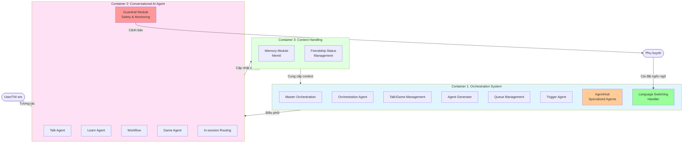
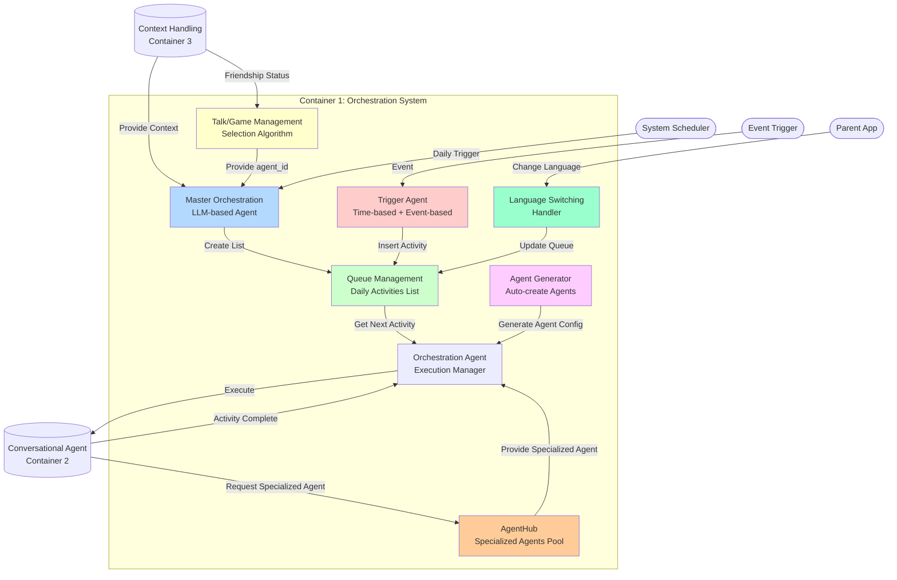
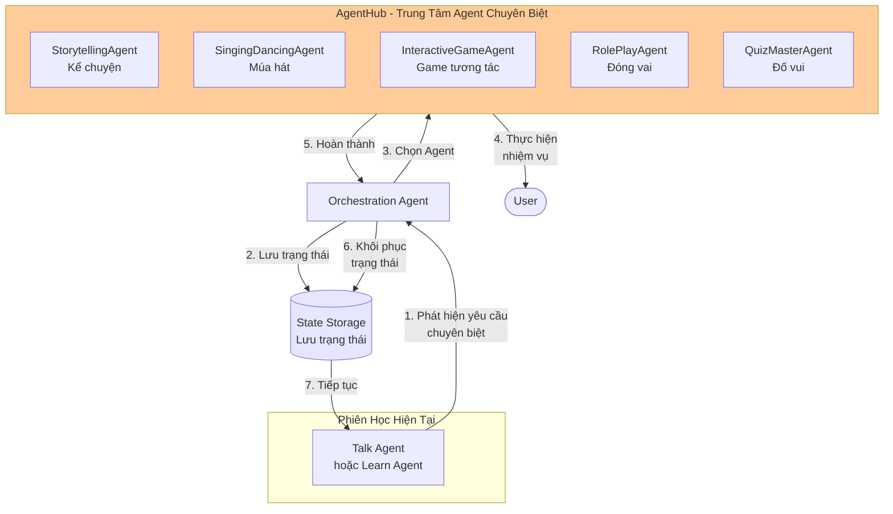
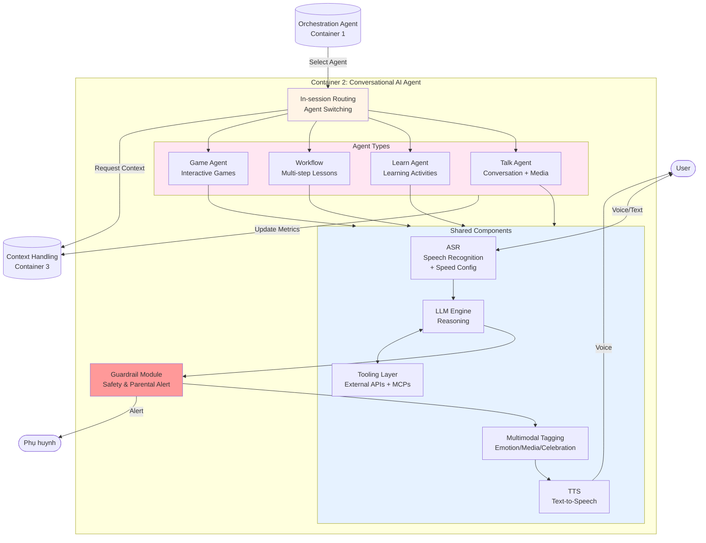
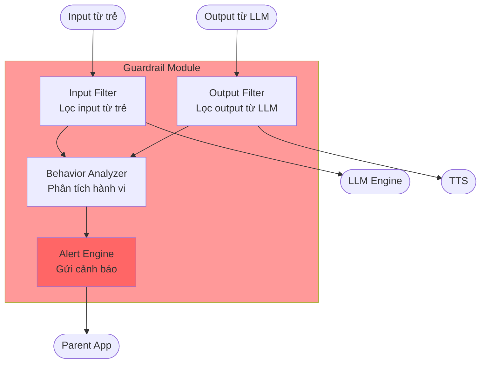
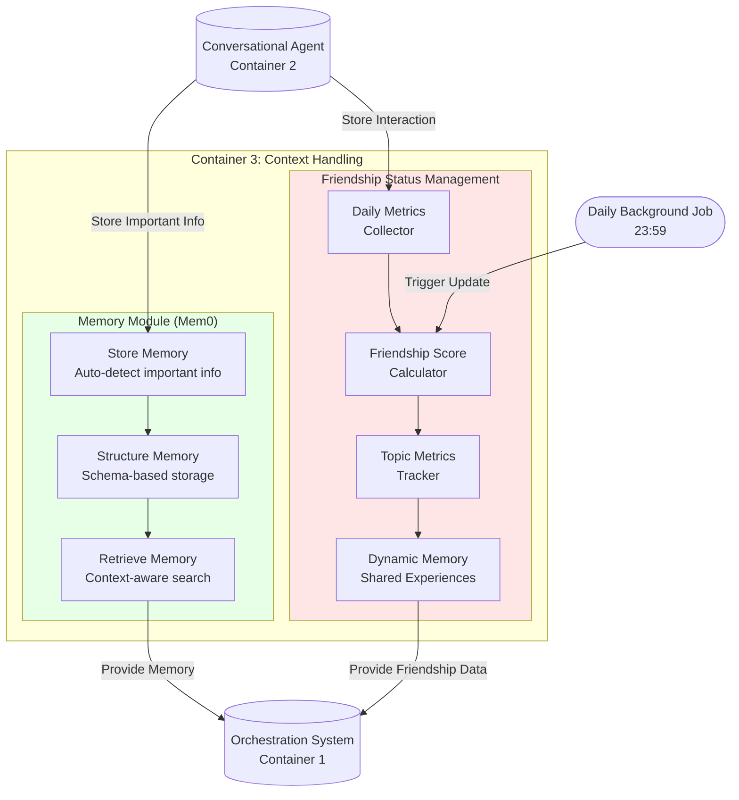

# Đặc Tả Kiến Trúc AI Platform — Hướng Dẫn Chi Tiết Cho Product Team

> **Loại tài liệu:** Technical Architecture (AI Platform)
> **Version:** 1.0
> **Date:** 23/12/2025
> **Trạng thái:** Active
>
> **Tóm tắt:** Đặc tả kiến trúc 3-container (Orchestration / Conversational AI Agent / Context Handling) của AI Platform Pika, bao gồm AgentHub, Guardrail Module, Memory (Mem0), và Friendship Status Management.

---

## 1. Tóm Tắt Điều Hành và Bối Cảnh Chiến Lược (Context)

### 1.1. Tóm Tắt Điều Hành (Executive Summary)

Tài liệu này là bản đặc tả chi tiết về kiến trúc **AI Platform** của Pika, được tái cấu trúc theo mô hình 3 lớp chức năng rõ ràng: **Orchestration**, **Conversation**, và **Context Handling**. Kiến trúc này được thiết kế để hướng dẫn Product Team trong việc phát triển và vận hành sản phẩm, đảm bảo tính nhất quán, khả năng mở rộng, và tập trung vào việc tạo ra một trải nghiệm học tiếng Anh giao tiếp được cá nhân hóa sâu sắc cho trẻ em.

### 1.2. Bối Cảnh Chiến Lược (Context)

| Khía Cạnh | Mô Tả Chi Tiết | Ý Nghĩa Chiến Lược cho Product Team |
| :--- | :--- | :--- |
| **Mục Tiêu Cấp Cao** | Tăng **Retention** và **Engagement** của trẻ em thông qua trải nghiệm học tiếng Anh giao tiếp được cá nhân hóa. | Mọi tính năng mới phải được đo lường dựa trên tác động của nó đến hai chỉ số này trong bối cảnh giáo dục. |
| **Lợi Thế Cạnh Tranh** | Kiến trúc 3 lớp tách biệt rõ ràng giữa **hoạch định (Orchestration)**, **thực thi (Conversation)**, và **dữ liệu (Context)**, cho phép phát triển độc lập, tối ưu hóa chuyên sâu từng mảng, và tăng tốc độ ra mắt tính năng mới. | Cho phép Product Team tập trung vào **chiến lược điều phối** và **trải nghiệm hội thoại** mà không bị ràng buộc bởi các chi tiết kỹ thuật của việc quản lý dữ liệu. |
| **Đối Tượng Người Dùng** | Trẻ em (từ 6-12 tuổi) học tiếng Anh giao tiếp. | Yêu cầu cao về **Safety (An toàn)**, **Engagement (Hấp dẫn)**, và **Personalization (Cá nhân hóa)** theo độ tuổi. |

### 1.3. Tổng Quan Kiến Trúc 3 Lớp

Kiến trúc được chia thành 3 Container (Lớp) chính, mỗi lớp chịu trách nhiệm cho một mảng chức năng riêng biệt và tương tác với nhau thông qua các API được định nghĩa rõ ràng.

| Container | Chức Năng Cốt Lõi | Ví Dụ Hoạt Động |
| :--- | :--- | :--- |
| **1. Orchestration System** | **Hoạch định và Điều phối:** Quyết định "Hôm nay trẻ nên làm gì?" và điều chỉnh kế hoạch đó dựa trên các sự kiện. Bao gồm **AgentHub** để quản lý các agent chuyên biệt. | Xây dựng Daily Activities List, chèn một GameAgent vào hàng đợi khi trẻ học quá lâu, transfer sang StorytellingAgent khi trẻ yêu cầu kể chuyện. |
| **2. Conversational AI Agent** | **Thực thi và Tương tác:** Giao tiếp trực tiếp với người dùng trong từng hoạt động cụ thể. Bao gồm **Guardrail** để đảm bảo an toàn. | Thực hiện một bài học về phát âm, trò chuyện về chủ đề khủng long, chơi một game đố vui. |
| **3. Context Handling** | **Quản lý và Cập nhật Dữ liệu:** Thu thập, xử lý, và duy trì tất cả dữ liệu về người dùng và mối quan hệ. | Cập nhật điểm tình bạn cuối ngày, lưu một "ký ức chung" mới vào Mem0. |

## 2. Container 1: Orchestration System (Hệ Thống Điều Phối)

### 2.1. Tổng Quan và Sơ Đồ Tương Tác

**Chức năng cốt lõi:** Orchestration System là "bộ não" của Pika, chịu trách nhiệm **hoạch định chiến lược** và **điều phối** toàn bộ trải nghiệm của người dùng. Nó quyết định trẻ sẽ làm gì, khi nào, và linh hoạt điều chỉnh kế hoạch đó dựa trên các sự kiện phát sinh, ngay cả khi trẻ không ở trong ứng dụng. Container này cũng bao gồm **AgentHub** - nơi quản lý các agent chuyên biệt cho các nhiệm vụ đặc thù như kể chuyện, múa hát, và chơi game.

**Luồng hoạt động chính:**
1.  **Master Orchestration** được kích hoạt hàng ngày, nhận dữ liệu từ **Container 3 (Context Handling)** để xây dựng một **Daily Activities List** (kế hoạch hoạt động trong ngày).
2.  Kế hoạch này được lưu vào **Queue Management** dưới dạng một hàng đợi ưu tiên.
3.  Khi người dùng bắt đầu phiên học, **Orchestration Agent** sẽ lấy hoạt động có độ ưu tiên cao nhất từ hàng đợi và yêu cầu **Container 2 (Conversational AI Agent)** thực thi.
4.  Trong khi đó, **Trigger Agent** liên tục lắng nghe các sự kiện (ví dụ: trẻ học quá 15 phút, hoặc 3 ngày không vào học). Khi một sự kiện xảy ra, nó sẽ chèn một hoạt động mới vào hàng đợi, làm thay đổi kế hoạch ban đầu.
5.  **Talk/Game Management** và **Agent Generator** là các module hỗ trợ, cung cấp các agent phù hợp và tạo ra các agent mới khi cần.
6.  **AgentHub** quản lý các agent chuyên biệt, sẵn sàng tiếp nhận khi Talk/Learn Agent cần transfer để thực hiện nhiệm vụ đặc thù.
7.  **Language Switching Handler** xử lý yêu cầu thay đổi ngôn ngữ từ phụ huynh và cập nhật lại queue tương ứng.

### 2.2. Master Orchestration

**Chức năng:** Là bộ não hoạch định chiến lược, sử dụng LLM để xây dựng một kế hoạch hoạt động hàng ngày (Daily Activities List) được cá nhân hóa sâu sắc cho mỗi người dùng.

| Khía Cạnh | Mô Tả Chi Tiết |
| :--- | :--- |
| **Input** | - **`user_id`** để xác định người dùng. - **Context JSON:** Một đối tượng JSON toàn diện từ Context Provider, bao gồm `learning_status`, `friendship_status`, và `user_profile`. |
| **Logic Xử Lý** | 1.  **Prompt Construction:** Xây dựng một prompt chi tiết cho LLM, bao gồm Context JSON và **10 Nguyên Tắc Vàng** (Guiding Principles) về sư phạm. 2.  **LLM Inference:** Gửi prompt đến LLM để nhận về một kế hoạch chiến lược (danh sách hoạt động và lý do). 3.  **List Building (V2 - Phased Orchestration):** Dựa trên **giai đoạn tình bạn** (Friendship Phase) của người dùng, hệ thống sẽ xây dựng một danh sách hoạt động hàng ngày theo các kịch bản chi tiết được định nghĩa sẵn. |
| **Output** | **Daily Activities List:** Một mảng JSON chứa các hoạt động cho ngày hôm đó, được sắp xếp theo thứ tự ưu tiên. |

### 2.3. Orchestration Agent

**Chức năng:** Là người quản lý và thực thi, chịu trách nhiệm lấy các hoạt động từ Queue Management và điều phối việc thực thi chúng trong phiên học.

| Khía Cạnh | Mô Tả Chi Tiết |
| :--- | :--- |
| **Input** | - **`user_id`** khi bắt đầu phiên học. - Tín hiệu "hoàn thành" từ hoạt động hiện tại. |
| **Logic Xử Lý** | 1.  Khi phiên học bắt đầu, gọi **Queue Management** để lấy hoạt động có `priority` cao nhất. 2.  Yêu cầu **In-session Routing (Container 2)** thực thi `activity_id` tương ứng. 3.  Chờ nhận tín hiệu "hoàn thành" (activity_completed). 4.  Lặp lại bước 1 để lấy hoạt động tiếp theo. |
| **Output** | - Yêu cầu thực thi đến **In-session Routing**. - Tín hiệu kết thúc phiên học khi hàng đợi trống hoặc người dùng thoát. |

### 2.4. Talk/Game Management

**Chức năng:** Hoạt động như một chuyên gia về sở thích, chịu trách nhiệm chọn ra một `agent_id` (Talk hoặc Game) phù hợp nhất khi được Master Orchestration hoặc Trigger Agent yêu cầu.

| Khía Cạnh | Mô Tả Chi Tiết |
| :--- | :--- |
| **Input** | - **`user_id`** để truy cập `friendship_status`. - **Context:** Gợi ý từ LLM (ví dụ: `{topic: "dinosaurs"}`). |
| **Logic Xử Lý** | 1.  **Xác định Phase:** Dựa trên `friendship_score` để xác định giai đoạn tình bạn (Stranger, Acquaintance, Friend). 2.  **Lọc Kho Hoạt động:** Giới hạn các kho Talk/Game được phép truy cập dựa trên Phase. 3.  **Tạo Danh sách Ứng viên:** Tạo một danh sách các agent tiềm năng dựa trên context, sở thích (`topic_metrics`), và ký ức chung (`dynamic_memory`). 4.  **Chọn Ứng viên Tốt nhất:** Ưu tiên các ứng viên và áp dụng bộ lọc chống lặp để chọn ra agent phù hợp nhất. |
| **Output** | Một `agent_id` duy nhất. |

### 2.5. Agent Generator

**Chức năng:** Tự động sinh ra các agent mới (chủ yếu là Learn Agent và Talk Agent) dựa trên một mẫu (template) và dữ liệu đầu vào, giúp giảm tải công việc thủ công và tăng khả năng cá nhân hóa.

| Khía Cạnh | Mô Tả Chi Tiết |
| :--- | :--- |
| **Input** | - **`user_profile`**: Để hiểu về điểm mạnh, điểm yếu của trẻ. - **`agent_template`**: Một cấu trúc định sẵn cho một loại agent (ví dụ: template cho một Learn Agent sửa lỗi ngữ pháp). |
| **Logic Xử Lý** | 1.  Nhận yêu cầu tạo agent (ví dụ: từ Trigger Agent sau khi phát hiện trẻ sai ngữ pháp nhiều). 2.  Chọn `agent_template` phù hợp (ví dụ: `template_grammar_review`). 3.  Điền các thông tin cụ thể vào template từ `user_profile` (ví dụ: `error_type: "simple_past_tense"`). 4.  Lưu cấu hình agent mới vào cơ sở dữ liệu và trả về `agent_id` mới. |
| **Output** | Một `agent_id` mới, sẵn sàng để được chèn vào hàng đợi. |

### 2.6. Queue Management (Daily Activities List)

**Chức năng:** Hoạt động như một hàng đợi ưu tiên (Priority Queue), lưu trữ và quản lý kế hoạch hoạt động hàng ngày.

| Khía Cạnh | Mô Tả Chi Tiết |
| :--- | :--- |
| **Cấu Trúc Dữ Liệu** | Một danh sách (list/array) các đối tượng, mỗi đối tượng đại diện cho một hoạt động và có các trường: `activity_id`, `activity_type`, `priority`, và `language`. |
| **Đặc Điểm** | - **Linh hoạt:** Cho phép các hoạt động có độ ưu tiên cao (ví dụ: từ Trigger Agent) "chen ngang" vào kế hoạch đã định sẵn. - **Minh bạch:** Cung cấp một cái nhìn rõ ràng về những gì người dùng sẽ làm tiếp theo. - **Hỗ trợ đa ngôn ngữ:** Mỗi hoạt động có thể được gắn với một ngôn ngữ cụ thể, cho phép cập nhật khi phụ huynh thay đổi cài đặt ngôn ngữ. |

### 2.7. Trigger Agent (Out-of-session Orchestration)

**Chức năng:** Hoạt động như một hệ thống giám sát ngầm, lắng nghe các sự kiện xảy ra cả trong và ngoài phiên học để điều chỉnh kế hoạch một cách linh hoạt.

| Khía Cạnh | Mô Tả Chi Tiết |
| :--- | :--- |
| **Input** | - **Time-based Events:** Các sự kiện dựa trên thời gian (ví dụ: đã 3 ngày trôi qua kể từ lần học cuối). - **Event-based Events:** Các sự kiện dựa trên hành động (ví dụ: trẻ vừa hoàn thành một bài học với điểm số thấp, hoặc vừa học liên tục 15 phút). |
| **Logic Xử Lý** | 1.  Lắng nghe các sự kiện từ hệ thống. 2.  Khi một sự kiện khớp với một quy tắc đã định (trigger rule), thực hiện hành động tương ứng. 3.  Hành động phổ biến nhất là yêu cầu **Agent Generator** tạo một agent mới và/hoặc chèn trực tiếp một `activity_id` vào **Queue Management** với độ ưu tiên cao. |
| **Output** | Một yêu cầu cập nhật đến **Queue Management**. |
| **Ví dụ** | - **Sự kiện:** `long_learning_session` (học > 15 phút). - **Hành động:** Yêu cầu **Talk/Game Management** chọn một GameAgent yêu thích và chèn vào hàng đợi với `priority: 8` để giảm căng thẳng. |

### 2.8. AgentHub (Trung Tâm Agent Chuyên Biệt)

**Chức năng:** AgentHub là một module quan trọng trong Orchestration System, hoạt động như một "trung tâm chuyên gia" chứa các Agent thực hiện các nhiệm vụ chuyên biệt. Khi người dùng đang học các bài Talk Agent hoặc Learn Agent mà có các yêu cầu đặc thù (như kể chuyện, múa hát, chơi game tương tác), hệ thống sẽ transfer sang Agent chuyên biệt tương ứng trong AgentHub để thực hiện nhiệm vụ đó một cách tốt nhất, giống như một chuyên gia trong lĩnh vực đó.

| Khía Cạnh | Mô Tả Chi Tiết |
| :--- | :--- |
| **Danh Sách Agent Chuyên Biệt** | - **StorytellingAgent:** Chuyên kể chuyện với giọng điệu hấp dẫn, có thể tạo ra các câu chuyện tương tác. - **SingingDancingAgent:** Hướng dẫn múa hát, bài hát tiếng Anh cho trẻ. - **InteractiveGameAgent:** Các trò chơi tương tác phức tạp hơn Game Agent thông thường. - **RolePlayAgent:** Đóng vai các nhân vật trong các tình huống giao tiếp. - **QuizMasterAgent:** Chuyên gia tổ chức các cuộc thi đố vui. |
| **Cơ Chế Transfer** | 1.  Trong quá trình tương tác, Talk/Learn Agent phát hiện yêu cầu chuyên biệt từ người dùng (ví dụ: "Pika ơi, kể chuyện cho con nghe đi!"). 2.  Agent hiện tại gửi yêu cầu transfer đến **Orchestration Agent** kèm theo context hiện tại. 3.  **Orchestration Agent** chọn Agent chuyên biệt phù hợp từ **AgentHub**. 4.  Agent chuyên biệt tiếp nhận và thực hiện nhiệm vụ. 5.  Sau khi hoàn thành, Agent chuyên biệt trả quyền điều khiển về cho Agent ban đầu với context đã cập nhật. |
| **Lưu Trữ Trạng Thái** | Khi transfer, trạng thái của phiên học hiện tại (conversation history, learning progress, current topic) được lưu tạm để có thể khôi phục sau khi Agent chuyên biệt hoàn thành. |

### 2.9. Language Switching Handler (Xử Lý Chuyển Đổi Ngôn Ngữ)

**Chức năng:** Cho phép phụ huynh thay đổi ngôn ngữ sử dụng của con thông qua Parent App. Khi ngôn ngữ được thay đổi, hệ thống sẽ cập nhật lại Daily Activities List để phản ánh ngôn ngữ mới.

| Khía Cạnh | Mô Tả Chi Tiết |
| :--- | :--- |
| **Input** | - Yêu cầu thay đổi ngôn ngữ từ Parent App (ví dụ: từ Tiếng Việt sang Tiếng Anh). - **`user_id`** của trẻ. |
| **Logic Xử Lý** | 1.  **BE (Orchestration Queue Executor)** nhận yêu cầu thay đổi ngôn ngữ từ Parent App. 2.  BE request tới **Orchestration (Queue Management)** qua API để gen lại todo list. 3.  **AI (Orchestration Queue Management)** gen lại list hoạt động với ngôn ngữ mới và trả về cho BE. 4.  BE dựa vào trạng thái hoạt động đã hoàn thành để thay trong queue:     - Các bài **Talk chưa hoàn thành**: BE call sang AI để gen lại list, từ đó lấy các bài talk với language mới.     - Các bài **Learn chưa hoàn thành**: BE sẽ lấy các bài tiếp theo chưa học ở learning path. |
| **Phạm Vi Áp Dụng** | Ở phiên bản hiện tại, chế độ ngôn ngữ chỉ áp dụng với các hoạt động **nằm ngoài lộ trình học chính** (ví dụ: greeting, buddy talk, daily chat). Ngôn ngữ của các bài Learn sẽ được quyết định bởi nội dung bài học được xây dựng từ trước, tuân theo các quy tắc học thuật, không bị ảnh hưởng bởi chế độ ngôn ngữ. Điều này có thể thay đổi trong tương lai. |
| **Output** | Daily Activities List đã được cập nhật với ngôn ngữ mới cho các hoạt động phù hợp. |

**Ví dụ minh họa:**

| Bước | Trạng Thái |
| :--- | :--- |
| Đầu ngày gen list | 1(Greet), 2(Talk), 3(T), 4(Learn), 5(L), 6(L), 7(T) |
| User học lần lượt hoặc từ menu | 1(G) - Done, 2(T) - Done, 3(T), 4(L) - Done, 5(L), 6(L), 7(T) |
| Sau khi chuyển ngôn ngữ cho các bài chưa done | 1(G) - Done, 2(T) - Done, 3(T - en), 4(L) - Done, 5(L - ko đổi), 6(L - ko đổi), 7(T - en) |

## 3. Container 2: Conversational AI Agent (Agent Tương Tác)

### 3.1. Tổng Quan và Sơ Đồ Tương Tác

**Chức năng cốt lõi:** Conversational AI Agent là "bộ mặt" và "giọng nói" của Pika. Container này chịu trách nhiệm **thực thi** các hoạt động được giao bởi Orchestration System và **tương tác trực tiếp** với người dùng. Đây là nơi các cuộc hội thoại, bài học, và trò chơi thực sự diễn ra. Container này cũng bao gồm **Guardrail Module** để đảm bảo an toàn cho trẻ và thông báo cho phụ huynh khi cần thiết.

**Luồng hoạt động chính:**
1.  **In-session Routing** nhận một `activity_id` từ **Orchestration Agent (Container 1)**.
2.  Nó xác định loại agent cần thực thi (Talk, Learn, Game, Workflow) và tải agent đó lên.
3.  Agent được tải sẽ sử dụng một bộ các **Shared Components** (Thành phần dùng chung) để tương tác với người dùng.
4.  Người dùng nói, **ASR** chuyển thành văn bản (với cấu hình tốc độ chờ phù hợp).
5.  Văn bản được đưa vào **LLM Engine** cùng với prompt của agent để xử lý và tạo ra phản hồi.
6.  Phản hồi đi qua **Guardrail Module** để kiểm tra an toàn trước khi gửi đến người dùng.
7.  LLM có thể sử dụng **Tooling Layer** (bao gồm MCPs) để truy cập thông tin bên ngoài hoặc sử dụng **Multimodal Tagging Layer** để làm giàu phản hồi với hình ảnh và âm thanh.
8.  Phản hồi cuối cùng được chuyển đến **TTS** để tạo ra giọng nói của Pika và gửi đến người dùng.
9.  Trong suốt quá trình, agent liên tục gửi các chỉ số tương tác đến **Container 3 (Context Handling)** để cập nhật.

### 3.2. Shared Components (Thành phần dùng chung)

Đây là các công nghệ nền tảng được tất cả các agent trong container này sử dụng để đảm bảo một trải nghiệm tương tác mượt mà và nhất quán.

| Component | Chức Năng | Phạm Vi Tác Động của PM |
| :--- | :--- | :--- |
| **ASR (Automatic Speech Recognition)** | Chuyển đổi giọng nói của trẻ thành văn bản với độ chính xác cao. Hỗ trợ **cấu hình tốc độ chờ** để phù hợp với từng tình huống và người dùng. | - Lựa chọn và tinh chỉnh model ASR cho phù hợp với giọng nói trẻ em. - Thiết kế UI/UX cho trạng thái lắng nghe và xử lý. - Cấu hình các mức tốc độ chờ phù hợp. |
| **LLM Engine** | Là bộ não xử lý ngôn ngữ, tạo ra các phản hồi thông minh, phù hợp với ngữ cảnh. | - Lựa chọn model LLM (ví dụ: GPT-4, Gemini). - Thiết kế và tối ưu hóa cấu trúc của **System Prompt**. - Định nghĩa các quy tắc an toàn (Safety Guardrails). |
| **TTS (Text-to-Speech)** | Chuyển đổi văn bản do LLM tạo ra thành giọng nói tự nhiên, có cảm xúc của Pika. | - Lựa chọn và tinh chỉnh giọng nói của Pika. - Thiết kế cách Pika thể hiện cảm xúc qua giọng nói. |
| **Tooling Layer** | Cung cấp cho LLM khả năng truy cập các công cụ bên ngoài và **MCPs (Model Context Protocols)** để mở rộng khả năng tương tác. | - Xác định các công cụ và MCPs cần thiết cho các kịch bản tương tác. - Thiết kế cách LLM yêu cầu và xử lý kết quả từ công cụ. |
| **Multimodal Tagging Layer** | Cho phép LLM gợi ý các hành vi (emotion), media, và hiệu ứng (celebration) thông qua một hệ thống tag đơn giản. | - Định nghĩa danh sách các tag được hỗ trợ (ví dụ: `[EMOTION:happy]`, `[CELEBRATE]`). - Thiết kế cách các tag này được ánh xạ sang các hiệu ứng hình ảnh và âm thanh cụ thể. |

#### 3.2.1. ASR Speed Configuration (Cấu Hình Tốc Độ Chờ STT)

Module ASR hỗ trợ cấu hình tốc độ chờ người dùng nói ở 3 mức độ khác nhau, cho phép tùy chỉnh trải nghiệm phù hợp với từng tình huống và đặc điểm của người dùng.

| Mức Độ | Tên Gọi | Mô Tả | Use Case Phù Hợp |
| :--- | :--- | :--- | :--- |
| **1** | **Kiên nhẫn (Patient)** | Chờ lâu hơn trước khi kết thúc lượt nghe. Timeout dài, cho phép người dùng suy nghĩ và nói chậm. | - Trẻ nhỏ đang học nói. - Các bài học phát âm cần thời gian chuẩn bị. - Trẻ có xu hướng nói chậm hoặc hay ngập ngừng. |
| **2** | **Trung bình (Normal)** | Mức cân bằng giữa kiên nhẫn và phản hồi nhanh. Đây là mức mặc định của hệ thống. | - Các cuộc trò chuyện thông thường. - Phần lớn các hoạt động học tập. |
| **3** | **Nhanh (Quick)** | Ngắt sớm hơn khi phát hiện người dùng đã nói xong. Phản hồi nhanh, tạo cảm giác hội thoại tự nhiên. | - Game Agent cần phản hồi nhanh. - Các hoạt động đố vui, trả lời nhanh. - Trẻ đã quen với hệ thống và nói lưu loát. |

**Cấu hình áp dụng:**

| Phạm Vi | Mô Tả |
| :--- | :--- |
| **Cấu hình chung (Global)** | Thiết lập mức mặc định cho toàn bộ hệ thống, áp dụng khi không có cấu hình cụ thể. |
| **Theo dạng hoạt động (Activity Type)** | Mỗi loại hoạt động (Talk, Learn, Game, Workflow) có thể có cấu hình riêng. Ví dụ: Game Agent mặc định dùng mức "Nhanh", Learn Agent dùng mức "Kiên nhẫn". |
| **Theo từng user (Tương lai)** | Trong các phiên bản tương lai, hệ thống sẽ hỗ trợ cấu hình riêng cho từng user dựa trên đặc điểm cá nhân và lịch sử tương tác. |

#### 3.2.2. Tooling Layer với MCP Integration

Tooling Layer được mở rộng để hỗ trợ tích hợp các **MCPs (Model Context Protocols)** bên ngoài, cho phép Pika truy cập nhiều nguồn thông tin và dịch vụ hơn để phục vụ các use case hàng ngày.

| MCP | Chức Năng | Use Case Ví Dụ |
| :--- | :--- | :--- |
| **Internet Search MCP** | Tìm kiếm thông tin trên internet theo thời gian thực. | - Trẻ hỏi "Khủng long lớn nhất thế giới là gì?" - Tìm kiếm thông tin về sự kiện, nhân vật. |
| **Weather MCP** | Kiểm tra thông tin thời tiết theo vị trí. | - "Hôm nay trời có mưa không Pika?" - Gợi ý hoạt động phù hợp với thời tiết. |
| **Dictionary MCP** | Tra cứu từ điển, phát âm, và ví dụ sử dụng từ. | - Giải thích nghĩa từ mới. - Cung cấp ví dụ câu sử dụng từ. |
| **Calendar MCP** | Truy cập lịch và sự kiện. | - Nhắc nhở về ngày sinh nhật, sự kiện đặc biệt. - Tạo các cuộc trò chuyện liên quan đến ngày lễ. |
| **Knowledge Base MCP** | Truy cập cơ sở kiến thức nội bộ về giáo dục. | - Cung cấp thông tin học thuật chính xác. - Hỗ trợ giải thích các khái niệm phức tạp. |

**Quy trình tích hợp MCP:**

1.  LLM Engine xác định cần thông tin bổ sung từ nguồn bên ngoài.
2.  LLM gọi Tooling Layer với yêu cầu cụ thể (ví dụ: `{tool: "weather", location: "Hanoi"}`).
3.  Tooling Layer chuyển yêu cầu đến MCP tương ứng.
4.  MCP trả về kết quả, được format và đưa vào context cho LLM.
5.  LLM tạo phản hồi cuối cùng dựa trên thông tin đã thu thập.

### 3.3. System Prompt Template (Cấu Trúc Mới)

System Prompt là bản chỉ dẫn cốt lõi được gửi đến LLM cho mọi lượt tương tác. Nó quyết định "tính cách" và "năng lực" của Pika. Cấu trúc mới được chia thành 7 phần rõ ràng để tối ưu hóa khả năng điều khiển và tính nhất quán.

| Phần | Tên | Nội Dung Chi Tiết |
| :--- | :--- | :--- |
| **1** | **Context** | - **Identity Pika:** "Bạn là Pika, một người bạn AI..." - **User Profile:** Thông tin về trẻ (tên, tuổi, sở thích). - **Mission:** Nhiệm vụ của Pika (giúp trẻ học tiếng Anh, xây dựng tình bạn). - **Personality:** Tính cách của Pika (tò mò, thân thiện, kiên nhẫn). |
| **2** | **Universal Style Guide** | - **Language:** Ngôn ngữ sử dụng (ví dụ: American English). - **Question Rule:** Quy tắc đặt câu hỏi (ví dụ: không hỏi quá 2 câu liên tiếp). - **Engagement:** Các kỹ thuật để tăng tương tác (ví dụ: dùng câu cảm thán, khen ngợi). |
| **3** | **Interaction Rules** | Các quy tắc tương tác cụ thể cho từng loại agent (ví dụ: trong Learn Agent, phải có đánh giá đúng/sai). |
| **4** | **Opening Guide, Goal & Trigger & Action** | - **Opening Guide:** Cách bắt đầu cuộc trò chuyện. - **Goal:** Mục tiêu của agent hiện tại (ví dụ: "Giúp trẻ học 5 từ vựng về động vật"). - **Trigger & Action:** Các kịch bản "Nếu... thì..." (ví dụ: "Nếu trẻ trả lời sai 2 lần, hãy đưa ra gợi ý"). |
| **5** | **User Memory** | Dữ liệu từ Mem0 và Friendship Status, bao gồm các ký ức chung và sở thích của trẻ. |
| **6** | **Technical & Safety** | - **`current_datetime`**: Ngày giờ hiện tại. - **Scoring & Emotion**: Cách đánh giá và ghi nhận cảm xúc. - **Format Rules Logic**: Quy tắc về định dạng output (ví dụ: phải là JSON). - **Tools**: Danh sách các công cụ LLM có thể sử dụng (bao gồm MCPs). - **Policies**: Các chính sách an toàn và bảo mật. |
| **7** | **Language + Level** | Ngôn ngữ và cấp độ phù hợp với người dùng (ví dụ: "English - A2 Level"). |

### 3.4. Talk Agent

**Chức năng:** Tập trung vào việc xây dựng và nuôi dưỡng mối quan hệ tình bạn giữa trẻ và Pika thông qua các cuộc trò chuyện tự nhiên, không có mục tiêu học tập rõ ràng. Talk Agent có khả năng **hiển thị hình ảnh và âm thanh** phù hợp lên màn hình Pika để tăng tính thú vị và hấp dẫn cho cuộc trò chuyện.

| Khía Cạnh | Mô Tả Chi Tiết |
| :--- | :--- |
| **Đặc điểm** | Linh hoạt, không theo kịch bản cứng, có khả năng gợi mở và đào sâu vào các chủ đề mà trẻ quan tâm. |
| **Ví dụ** | `agent_daily_chat_sports_topic`, `agent_encouragement_chat`. |
| **Media Display** | AI có thể chọn các hình ảnh và âm thanh phù hợp để hiển thị lên màn hình Pika, tăng tính thú vị, hấp dẫn và tò mò cho cuộc trò chuyện. |

#### 3.4.1. Media Display trong Talk Agent

Trong các bài Talk, AI có khả năng lựa chọn và hiển thị các **hình ảnh (images)** và **âm thanh (sounds)** phù hợp với ngữ cảnh cuộc trò chuyện lên màn hình thiết bị Pika. Tính năng này giúp tăng cường trải nghiệm tương tác và kích thích sự tò mò, hứng thú của trẻ.

| Loại Media | Mô Tả | Ví Dụ Sử Dụng |
| :--- | :--- | :--- |
| **Hình ảnh minh họa** | Hiển thị hình ảnh liên quan đến chủ đề đang trò chuyện. | Khi nói về khủng long, hiển thị hình ảnh T-Rex. Khi nói về thời tiết, hiển thị hình ảnh mặt trời hoặc mưa. |
| **Hình ảnh biểu cảm** | Hiển thị các biểu cảm của Pika để tăng tính cảm xúc. | Pika vui khi trẻ trả lời đúng, Pika buồn khi trẻ nói tạm biệt. |
| **Âm thanh hiệu ứng** | Phát các âm thanh ngắn để tăng tính sinh động. | Tiếng vỗ tay khi trẻ hoàn thành tốt, tiếng chuông khi có thông báo quan trọng. |
| **Âm thanh môi trường** | Phát âm thanh nền phù hợp với chủ đề. | Tiếng sóng biển khi nói về biển, tiếng chim hót khi nói về thiên nhiên. |

**Cơ chế hoạt động:**

1.  LLM Engine phân tích ngữ cảnh cuộc trò chuyện và xác định media phù hợp.
2.  LLM sử dụng **Multimodal Tagging Layer** để gắn tag media vào phản hồi (ví dụ: `[IMAGE:dinosaur_trex]`, `[SOUND:applause]`).
3.  AI Wrapper xử lý các tag và gửi yêu cầu hiển thị đến thiết bị Pika.
4.  Thiết bị Pika hiển thị hình ảnh hoặc phát âm thanh đồng bộ với giọng nói của Pika.

### 3.5. Learn Agent

**Chức năng:** Tập trung vào một mục tiêu học tập cụ thể, chẳng hạn như luyện một kỹ năng phát âm, học một bộ từ vựng, hoặc sửa một lỗi ngữ pháp.

- **Đặc điểm:** Có cấu trúc rõ ràng, có cơ chế đánh giá đúng/sai, và thường đi kèm với các hoạt động tương tác (ví dụ: lặp lại một câu, trả lời câu hỏi).
- **Ví dụ:** `lesson_review_pronunciation_th`, `learn_agent_irregular_verbs`.

### 3.6. Workflow

**Chức năng:** Là một chuỗi các hoạt động được kết nối với nhau để tạo thành một bài học hoàn chỉnh, thường bao gồm nhiều bước và có thể kết hợp cả Learn Agent và Talk Agent.

- **Đặc điểm:** Có tính tuần tự, mỗi bước phụ thuộc vào kết quả của bước trước. Thường được sử dụng cho các bài học chính trong lộ trình học tập.
- **Ví dụ:** Một workflow học về "simple past tense" có thể bao gồm: (1) Giới thiệu lý thuyết, (2) Luyện tập với câu đơn, (3) Trò chuyện ngắn sử dụng thì quá khứ đơn.

### 3.7. Game Agent

**Chức năng:** Cung cấp các trò chơi tương tác để củng cố kiến thức, tăng cường sự hứng thú, và giảm căng thẳng sau các hoạt động học tập.

- **Đặc điểm:** Có luật chơi rõ ràng, có tính điểm hoặc phần thưởng, và tập trung vào sự vui vẻ.
- **Ví dụ:** `game_dino_quiz_4`, `game_animal_sounds_3`.

### 3.8. In-session Routing

**Chức năng:** Hoạt động như một "bộ điều phối cấp thấp" bên trong phiên học. Nó nhận yêu cầu từ Orchestration Agent và đảm bảo agent tương ứng được tải và thực thi.

| Khía Cạnh | Mô Tả Chi Tiết |
| :--- | :--- |
| **Input** | Một `activity_id` từ **Orchestration Agent**. |
| **Logic Xử Lý** | 1.  Phân tích `activity_id` để xác định loại agent (ví dụ: `game_` -> GameAgent, `lesson_` -> LearnAgent). 2.  Tải cấu hình của agent từ cơ sở dữ liệu. 3.  Xây dựng **System Prompt** cụ thể cho agent đó. 4.  Khởi tạo agent và bắt đầu phiên tương tác với người dùng. |
| **Output** | Một agent đang hoạt động, sẵn sàng để tương tác. |

### 3.9. Guardrail Module (Module An Toàn và Giám Sát)

**Chức năng:** Guardrail Module là một lớp bảo vệ quan trọng trong hệ thống, chịu trách nhiệm **chặn lọc** mọi nội dung có thể ảnh hưởng tiêu cực đến trẻ hoặc vi phạm luật pháp, đạo đức. Đồng thời, module này cũng **giám sát** hành vi của trẻ để phát hiện các dấu hiệu cần can thiệp và thông báo cho phụ huynh.

| Khía Cạnh | Mô Tả Chi Tiết |
| :--- | :--- |
| **Chức năng chính** | 1. **Content Filtering:** Chặn lọc nội dung không phù hợp. 2. **Behavior Monitoring:** Giám sát hành vi và cảm xúc của trẻ. 3. **Parental Alerting:** Thông báo cho phụ huynh khi cần thiết. |
| **Input** | - Tất cả input từ người dùng (text sau ASR). - Tất cả output từ LLM trước khi gửi đến người dùng. - Metadata về phiên tương tác (thời lượng, tần suất, cảm xúc). |
| **Output** | - Nội dung đã được lọc (hoặc chặn hoàn toàn nếu vi phạm nghiêm trọng). - Cảnh báo đến Parent App khi phát hiện vấn đề. |

#### 3.9.1. Content Filtering (Chặn Lọc Nội Dung)

Guardrail Module thực hiện chặn lọc đa tầng để đảm bảo mọi nội dung trao đổi giữa Pika và trẻ đều an toàn và phù hợp.

| Loại Nội Dung Bị Chặn | Mô Tả | Hành Động |
| :--- | :--- | :--- |
| **Nội dung bạo lực** | Mô tả hành vi bạo lực, gây hại, hoặc đe dọa. | Chặn và chuyển hướng cuộc trò chuyện sang chủ đề tích cực. |
| **Nội dung người lớn** | Nội dung liên quan đến tình dục, ma túy, rượu bia. | Chặn hoàn toàn và ghi log để review. |
| **Thông tin cá nhân nhạy cảm** | Địa chỉ nhà, số điện thoại, thông tin tài chính. | Chặn và nhắc nhở trẻ về việc bảo vệ thông tin cá nhân. |
| **Nội dung vi phạm pháp luật** | Hướng dẫn các hành vi vi phạm pháp luật. | Chặn hoàn toàn và thông báo phụ huynh. |
| **Nội dung phân biệt đối xử** | Phân biệt chủng tộc, giới tính, tôn giáo. | Chặn và giáo dục về sự tôn trọng đa dạng. |

#### 3.9.2. Behavior Monitoring (Giám Sát Hành Vi)

Guardrail Module liên tục giám sát các tín hiệu từ cuộc trò chuyện để phát hiện các dấu hiệu cần can thiệp sớm.

| Dấu Hiệu Giám Sát | Mô Tả | Hành Động |
| :--- | :--- | :--- |
| **Trầm cảm** | Trẻ thể hiện sự buồn bã kéo dài, mất hứng thú, nói về việc không muốn tồn tại. | Gửi cảnh báo **khẩn cấp** đến phụ huynh kèm theo transcript cuộc trò chuyện. |
| **Lo lắng quá mức** | Trẻ thể hiện sự lo lắng, sợ hãi bất thường về nhiều chủ đề. | Gửi cảnh báo đến phụ huynh và điều chỉnh nội dung trò chuyện để trấn an. |
| **Bắt nạt** | Trẻ đề cập đến việc bị bắt nạt hoặc có hành vi bắt nạt. | Gửi cảnh báo đến phụ huynh với chi tiết tình huống. |
| **Vấn đề gia đình** | Trẻ đề cập đến các vấn đề nghiêm trọng trong gia đình. | Gửi cảnh báo đến phụ huynh một cách tế nhị. |
| **Hành vi tự hại** | Bất kỳ đề cập nào về việc tự gây hại bản thân. | Gửi cảnh báo **khẩn cấp** đến phụ huynh ngay lập tức. |

#### 3.9.3. Parental Alerting (Thông Báo Phụ Huynh)

Khi Guardrail Module phát hiện các dấu hiệu cần can thiệp, hệ thống sẽ gửi thông báo đến phụ huynh thông qua Parent App.

| Mức Độ Cảnh Báo | Mô Tả | Kênh Thông Báo |
| :--- | :--- | :--- |
| **Thông tin (Info)** | Các thông tin hữu ích về hoạt động học tập của trẻ. | Push notification thông thường. |
| **Cảnh báo (Warning)** | Các dấu hiệu cần theo dõi nhưng chưa nghiêm trọng. | Push notification + Email. |
| **Khẩn cấp (Critical)** | Các dấu hiệu nghiêm trọng cần can thiệp ngay. | Push notification + Email + SMS (nếu có). |

## 4. Container 3: Context Handling (Quản Lý Ngữ Cảnh)

### 4.1. Tổng Quan và Sơ Đồ Tương Tác

**Chức năng cốt lõi:** Context Handling là "bộ nhớ" của Pika. Container này chịu trách nhiệm **thu thập, xử lý, và duy trì** tất cả dữ liệu về người dùng và mối quan hệ của họ với Pika. Nó cung cấp "nguyên liệu" đầu vào cho Orchestration System để đưa ra các quyết định thông minh và đảm bảo tính liên tục, cá nhân hóa cho trải nghiệm người dùng.

**Luồng hoạt động chính:**
1.  Trong suốt quá trình tương tác, **Conversational AI Agent (Container 2)** liên tục gửi các dữ liệu thô (ví dụ: số lượt trò chuyện, cảm xúc, thông tin quan trọng) đến **Context Handling**.
2.  **Daily Metrics Collector** thu thập và lưu trữ tạm thời các chỉ số tương tác trong ngày.
3.  **Memory Module (Mem0)** tự động phát hiện và lưu trữ các thông tin quan trọng, đáng nhớ dưới dạng có cấu trúc.
4.  Vào cuối ngày (23:59), một **Daily Background Job** sẽ kích hoạt **Friendship Score Calculator**.
5.  Calculator đọc dữ liệu từ **Daily Metrics**, tính toán sự thay đổi, và cập nhật vào các thành phần dài hạn như **Friendship Score**, **Topic Metrics**, và **Dynamic Memory**.
6.  Khi **Orchestration System (Container 1)** cần đưa ra quyết định, nó sẽ gọi đến **Context Handling** để lấy dữ liệu `friendship_status` và `memory` mới nhất.

### 4.2. Memory Module (Mem0)

**Chức năng:** Hoạt động như một bộ nhớ dài hạn, tự động ghi lại các thông tin quan trọng về người dùng (sở thích, sự kiện trong đời, điểm mạnh/yếu) để Pika có thể "nhớ" và nhắc lại trong các cuộc trò chuyện sau này.

| Component | Chức Năng | Ví Dụ |
| :--- | :--- | :--- |
| **Store Memory** | Tự động phát hiện các thông tin quan trọng từ cuộc hội thoại. | LLM phát hiện câu nói "My dog's name is Milu" và gắn cờ đây là một thông tin cần lưu. |
| **Structure Memory** | Lưu trữ thông tin dưới dạng có cấu trúc (schema-based) để dễ dàng truy vấn. | Lưu dưới dạng `{type: "pet_info", name: "Milu", species: "dog"}`. |
| **Retrieve Memory** | Cung cấp các thông tin liên quan khi được các agent khác yêu cầu. | Khi trò chuyện về chủ đề "động vật", agent có thể truy vấn Mem0 để hỏi "How is Milu today?". |

### 4.3. Friendship Status Management

**Chức năng:** Quản lý toàn bộ trạng thái mối quan hệ giữa trẻ và Pika. Đây là trái tim của việc cá nhân hóa trải nghiệm, quyết định cách Pika tương tác và lựa chọn hoạt động.

| Component | Chức Năng | Cấu Trúc Dữ Liệu (Ví dụ) |
| :--- | :--- | :--- |
| **Daily Metrics Collector** | Thu thập các chỉ số tương tác thô trong một ngày. Dữ liệu này sẽ được xử lý và xóa sau khi cập nhật cuối ngày. | `{"total_turns": 25, "user_initiated_questions": 3, "session_emotion": "interesting"}` |
| **Friendship Score Calculator** | Tính toán sự thay đổi của điểm tình bạn dựa trên các chỉ số trong ngày. | `daily_change_score = (total_turns * 0.5) + (user_questions * 3) + (emotion_bonus)` |
| **Topic Metrics Tracker** | Theo dõi mức độ quan tâm của trẻ đối với từng chủ đề trò chuyện. | `{"agent_movie": {"topic_score": 45.0, "total_turns": 50}, "agent_animal": {"topic_score": 22.5}}` |
| **Dynamic Memory Manager** | Lưu trữ các "ký ức chung" cụ thể, những khoảnh khắc đáng nhớ giữa trẻ và Pika. | `[{"memory_id": "mem_01", "content": "Hứa sẽ cùng nhau xem phim Vùng Đất Linh Hồn."}]` |

### 4.4. Daily Update Logic (Logic Cập Nhật Cuối Ngày)

Đây là một quy trình tự động (background job) chạy vào cuối mỗi ngày để đảm bảo dữ liệu `friendship_status` luôn được cập nhật, phản ánh đúng các tương tác trong ngày.

**Quy trình thực thi:**
1.  **Trigger:** Tác vụ được kích hoạt tự động vào 23:59 mỗi ngày.
2.  **Query:** Lấy tất cả các bản ghi người dùng có `daily_metrics` không rỗng.
3.  **Calculate:** Với mỗi người dùng, gọi **Friendship Score Calculator** để tính toán `daily_change_score`.
4.  **Update:**
    -   Cập nhật `friendship_score` và `friendship_level`.
    -   Cập nhật `topic_score` và `total_turns` trong `topic_metrics`.
    -   Cập nhật `streak_day` và `last_interaction_date`.
5.  **Cleanup:** Reset `daily_metrics` về rỗng để chuẩn bị cho ngày hôm sau.

## 5. Phạm Vi Tác Động của Product Team và Kỹ Thuật

Bảng dưới đây phân định rõ trách nhiệm giữa Product Team (PM) và Kỹ Thuật (Engineering) trong việc phát triển và vận hành AI Platform.

| Container | Trách Nhiệm của Product Team (PM) | Trách Nhiệm của Kỹ Thuật (Engineering) |
| :--- | :--- | :--- |
| **1. Orchestration System** | - **Định nghĩa Guiding Principles** cho Master Orchestration. - **Thiết kế Trigger Rules** (ví dụ: khi nào chèn game, khi nào chèn bài ôn tập). - **Xác định Priority Levels** cho các loại hoạt động. - **Thiết kế logic lựa chọn** cho Talk/Game Management. - **Định nghĩa danh sách Agent chuyên biệt** trong AgentHub. - **Thiết kế quy tắc Language Switching**. | - Xây dựng và tối ưu hóa pipeline của Master Orchestration. - Triển khai cơ chế lắng nghe sự kiện của Trigger Agent. - Xây dựng API cho Talk/Game Management. - Đảm bảo Queue Management hoạt động ổn định. - Triển khai AgentHub và cơ chế transfer. - Xây dựng Language Switching Handler. |
| **2. Conversational AI Agent** | - **Thiết kế Persona** và giọng văn của Pika. - **Viết và tối ưu hóa System Prompt** cho các loại agent. - **Định nghĩa các Tools và MCPs** cần thiết cho Tooling Layer. - **Thiết kế danh sách Multimodal Tags** và trải nghiệm đi kèm. - **Thiết kế nội dung** cho các Learn Agent và Workflow. - **Cấu hình ASR Speed** cho từng loại hoạt động. - **Định nghĩa quy tắc Guardrail** và các mức cảnh báo. - **Thiết kế Media Library** cho Talk Agent. | - Tinh chỉnh và triển khai các model ASR, LLM, TTS. - Xây dựng Tooling Layer và tích hợp MCPs. - Xây dựng AI Wrapper để xử lý Multimodal Tags. - Xây dựng bộ khung (framework) để chạy các loại agent khác nhau. - Triển khai ASR Speed Configuration. - Xây dựng Guardrail Module và Alert Engine. - Xây dựng Media Display System. |
| **3. Context Handling** | - **Định nghĩa cấu trúc dữ liệu** của Mem0 và Friendship Status. - **Thiết kế công thức tính Friendship Score** và các chỉ số liên quan. - **Xác định các loại thông tin** cần được lưu vào Mem0. - **Thiết kế các cấp độ tình bạn** (Friendship Levels) và ý nghĩa của chúng. | - Xây dựng và vận hành cơ sở dữ liệu NoSQL. - Triển khai logic tự động phát hiện và lưu trữ của Mem0. - Xây dựng background job để chạy Daily Update Logic. - Đảm bảo tính toàn vẹn và bảo mật của dữ liệu người dùng. |

## 6. Quy Trình Triển Khai Ý Tưởng Sản Phẩm

1.  **Ý tưởng (Idea):** PM có một ý tưởng mới, ví dụ: "Pika nên có một hoạt động ôn tập từ vựng hàng tuần".
2.  **Phân loại (Categorize):** PM xác định ý tưởng này thuộc về container nào. Trong ví dụ này, nó thuộc về **Orchestration System** (vì liên quan đến việc chèn một hoạt động mới vào kế hoạch).
3.  **Đặc tả (Specification):** PM viết đặc tả chi tiết cho ý tưởng:
    -   **Trigger:** Time-based, kích hoạt vào mỗi Chủ Nhật hàng tuần.
    -   **Action:** Chèn một `WeeklyVocabularyReviewAgent` vào Daily Activities List với `priority: 9`.
    -   **Agent:** `WeeklyVocabularyReviewAgent` sẽ lấy 10 từ vựng mà trẻ hay sai nhất trong tuần từ `learning_status` để ôn tập.
4.  **Triển khai (Implementation):**
    -   **Team Kỹ thuật (Orchestration):** Thêm một quy tắc mới vào **Trigger Agent**.
    -   **Team Kỹ thuật (Conversation):** Xây dựng `WeeklyVocabularyReviewAgent` theo đặc tả.
5.  **Kiểm thử và Ra mắt (Test & Launch):** Tính năng được kiểm thử và triển khai.

## 7. Câu Hỏi Thường Gặp (Q&A)

**Q1: Tại sao lại tách thành 3 container riêng biệt?**

> **A:** Việc tách thành 3 container (Orchestration, Conversation, Context) giúp chúng ta: (1) **Phát triển độc lập:** Mỗi team có thể tập trung vào một mảng mà không ảnh hưởng đến các team khác. (2) **Tối ưu hóa chuyên sâu:** Có thể lựa chọn công nghệ tốt nhất cho từng nhiệm vụ (ví dụ: dùng LLM cho hoạch định, dùng model nhỏ hơn cho conversation). (3) **Dễ dàng mở rộng:** Có thể thay thế hoặc nâng cấp một container mà không cần xây dựng lại toàn bộ hệ thống.

**Q2: Master Orchestration và Orchestration Agent khác nhau như thế nào?**

> **A:** Hãy tưởng tượng Master Orchestration là một **nhà chiến lược quân sự**, người ngồi trong phòng và vạch ra kế hoạch tác chiến cho cả một ngày. Orchestration Agent là một **sĩ quan chỉ huy ngoài mặt trận**, người nhận kế hoạch đó và ra lệnh cho từng đơn vị (Talk Agent, Learn Agent) thực hiện nhiệm vụ của mình theo đúng thứ tự.

**Q3: Trigger Agent có thể làm gián đoạn phiên học của trẻ không?**

> **A:** Không. Trigger Agent không trực tiếp làm gián đoạn. Nó chỉ **chèn một hoạt động mới** vào hàng đợi (Queue Management). Hoạt động đó chỉ được thực thi **sau khi** trẻ hoàn thành hoạt động hiện tại. Điều này đảm bảo luồng học tập của trẻ không bị cắt ngang một cách đột ngột.

**Q4: Dữ liệu trong Context Handling được cập nhật khi nào?**

> **A:** Có hai luồng cập nhật: (1) **Cập nhật thời gian thực:** Các chỉ số cơ bản như `total_turns` được cập nhật ngay trong phiên học. (2) **Cập nhật cuối ngày:** Các chỉ số quan trọng như `friendship_score` và `topic_metrics` được tính toán và cập nhật một lần vào cuối ngày thông qua một background job. Điều này giúp giảm tải cho hệ thống và đảm bảo tính nhất quán của dữ liệu.

**Q5: Làm thế nào để thêm một Game mới vào hệ thống?**

> **A:** Quy trình bao gồm: (1) **Team Game:** Xây dựng Game Agent mới. (2) **Team Kỹ thuật (Conversation):** Tích hợp Game Agent vào framework. (3) **PM:** Cập nhật kho hoạt động của **Talk/Game Management** để module này có thể lựa chọn game mới dựa trên các quy tắc đã định. Master Orchestration không cần thay đổi gì.

**Q6: AgentHub hoạt động như thế nào khi trẻ yêu cầu kể chuyện trong lúc đang học?**

> **A:** Khi trẻ đang trong một phiên Talk Agent hoặc Learn Agent và yêu cầu "Pika ơi, kể chuyện cho con nghe đi!", hệ thống sẽ: (1) Agent hiện tại nhận diện yêu cầu chuyên biệt và gửi request đến Orchestration Agent. (2) Orchestration Agent lưu trạng thái phiên học hiện tại. (3) StorytellingAgent từ AgentHub được kích hoạt và kể chuyện cho trẻ. (4) Sau khi kể xong, quyền điều khiển được trả về cho Agent ban đầu với context đã cập nhật. Trẻ có thể tiếp tục bài học như bình thường.

**Q7: Guardrail Module có làm chậm phản hồi của Pika không?**

> **A:** Guardrail Module được thiết kế để hoạt động với độ trễ tối thiểu. Việc lọc nội dung được thực hiện song song với các bước xử lý khác và sử dụng các model nhẹ, tối ưu cho tốc độ. Trong hầu hết các trường hợp, người dùng sẽ không nhận thấy sự khác biệt về thời gian phản hồi.

**Q8: Phụ huynh có thể thay đổi ngôn ngữ cho con bất cứ lúc nào không?**

> **A:** Có, phụ huynh có thể thay đổi ngôn ngữ thông qua Parent App bất cứ lúc nào. Tuy nhiên, cần lưu ý rằng ở phiên bản hiện tại, việc thay đổi ngôn ngữ chỉ ảnh hưởng đến các hoạt động nằm ngoài lộ trình học chính (như greeting, buddy talk). Các bài Learn sẽ giữ nguyên ngôn ngữ theo nội dung đã được thiết kế sẵn.

**Q9: MCPs được tích hợp như thế nào và có an toàn không?**

> **A:** MCPs được tích hợp thông qua Tooling Layer với các lớp bảo mật nghiêm ngặt: (1) Chỉ các MCPs đã được phê duyệt mới được phép sử dụng. (2) Tất cả kết quả từ MCPs đều đi qua Guardrail Module trước khi đến trẻ. (3) Các MCPs không có quyền truy cập vào dữ liệu cá nhân của trẻ. (4) Mọi cuộc gọi MCP đều được ghi log để audit.

#### 2.2.1. Phased Orchestration Logic (Logic Điều Phối Theo Giai Đoạn)

Cơ chế điều phối được chia thành 4 giai đoạn chính, dựa trên mức độ thân thiết (friendship phase) của người dùng. Mỗi giai đoạn có một mục tiêu và một kịch bản hoạt động riêng để tối ưu hóa trải nghiệm.

**Giai đoạn 0: Lần đầu gặp gỡ (First Encounter)**
- **Thời lượng:** 2 ngày đầu tiên.
- **Mục tiêu:** Giới thiệu và giúp người dùng làm quen với hệ thống.
- **Cơ chế:** Luồng tương tác được kịch bản hóa cố định, tập trung vào các hoạt động onboarding. BE sẽ chuẩn bị sẵn các learn unit và talk prompt cho 2 ngày đầu. Hệ thống sẽ đảm bảo người dùng hoàn thành hoạt động của ngày 0 (D0) trước khi chuyển sang ngày 1 (D1).

**Giai đoạn 1: Người lạ (Stranger)**
- **Điều kiện:** < 7 engaged days.
- **Mục tiêu:** Ưu tiên cho việc trò chuyện, xây dựng mối quan hệ, kết hợp với học tiếng Anh ở mức độ cơ bản.
- **Cơ chế:** Cung cấp 7 block hoạt động mỗi ngày, tập trung vào các hoạt động `Talk Topic` và `Talk Activity` để tăng cường tương tác.

| Thứ tự | Hoạt động | Mô tả |
|---|---|---|
| 1 | Greeting & Daily Check-in | Agent chủ động chào hỏi và kiểm tra nhanh. |
| 2 | Talk Topic | Agent gợi ý chủ đề trò chuyện trong ngày. |
| 3 | Talk Activity | Agent dẫn dắt hoạt động trò chuyện liên quan đến chủ đề. |
| 4 | English Warm-up / Review | Warm-up thuộc learning loop / 1 Agent Review. |
| 5 | English Loop - Unit 1 | Hoạt động học tiếng Anh chính. |
| 6 | English Loop - Unit 2 | Hoạt động học tiếng Anh chính. |
| 7 | Wrap-up | Pika chủ động đi nghỉ ngơi. |

**Giai đoạn 2: Bạn bè (Friend)**
- **Điều kiện:** 7-13 engaged days.
- **Mục tiêu:** Tăng cường các hoạt động học tiếng Anh và cá nhân hóa chủ đề trò chuyện dựa trên sở thích của người dùng.
- **Cơ chế:** Tăng số lượng `English Loop` lên 3 unit và thay thế các hoạt động trò chuyện mở bằng các hoạt động ngẫu nhiên (`Topic Activity / Game / Talk`) về các chủ đề mà người dùng yêu thích.

| Thứ tự | Hoạt động | Mô tả |
|---|---|---|
| 1 | Greeting & Daily Check-in | Agent chủ động chào hỏi và kiểm tra nhanh. |
| 2 | English Game Warm-up / Review | Warm-up thuộc learning loop / 1 Agent Review. |
| 3 | English Loop - Unit 1 | Hoạt động học tiếng Anh chính. |
| 4 | English Loop - Unit 2 | Hoạt động học tiếng Anh chính. |
| 5 | English Loop - Unit 3 | (Mới) Thêm một đơn vị học tiếng Anh. |
| 6 | Topic Activity / Game / Talk | Hoạt động ngẫu nhiên (trò chuyện, game,...) về chủ đề có điểm yêu thích cao. |
| 7 | Wrap-up | Pika chủ động đi nghỉ ngơi. |

**Giai đoạn 3: Bạn thân (Best Friend)**
- **Điều kiện:** >= 14 engaged days.
- **Mục tiêu:** Tối ưu hóa hoàn toàn cho việc học tiếng Anh, kết hợp với các hoạt động giải trí nhẹ nhàng.
- **Cơ chế:** Giữ 3 `English Loop` và một hoạt động ngẫu nhiên liên quan đến một chủ đề cụ thể để duy trì sự gắn kết.

| Thứ tự | Hoạt động | Mô tả |
|---|---|---|
| 1 | Greeting & Daily Check-in | Agent chủ động chào hỏi. |
| 2 | English Game Warm-up | Warm-up thuộc learning loop / 1 Agent Review. |
| 3 | English Loop - Unit 1 | Hoạt động học tiếng Anh chính. |
| 4 | English Loop - Unit 2 | Hoạt động học tiếng Anh chính. |
| 5 | English Loop - Unit 3 | Hoạt động học tiếng Anh chính. |
| 6 | Topic Talk / Activity / Game | Hoạt động ngẫu nhiên liên quan đến một chủ đề. |
| 7 | Wrap-up | Pika chủ động đi nghỉ ngơi. |

#### 4.3.1. Friendship Phase Calculation (Tính Toán Giai Đoạn Tình Bạn)

Việc xác định người dùng đang ở giai đoạn tình bạn nào (Stranger, Friend, Best Friend) được dựa trên chỉ số **"Engaged Days"**.

| Khái Niệm | Mô Tả Chi Tiết |
| :--- | :--- |
| **Engaged Day** | Một ngày được tính là "engaged" nếu người dùng hoàn thành **>= 70%** các hoạt động trong Daily Activities List (todo list) của ngày hôm đó. |
| **Cách Tính Giai Đoạn** | - **Giai đoạn 1 (Stranger):** < 7 engaged days. - **Giai đoạn 2 (Friend):** 7-13 engaged days. - **Giai đoạn 3 (Best Friend):** >= 14 engaged days. |
| **Cập Nhật** | Số lượng `engaged_days` được tính toán và cập nhật vào cuối mỗi ngày trong **Daily Update Logic**, dựa trên `daily_metrics`. |
